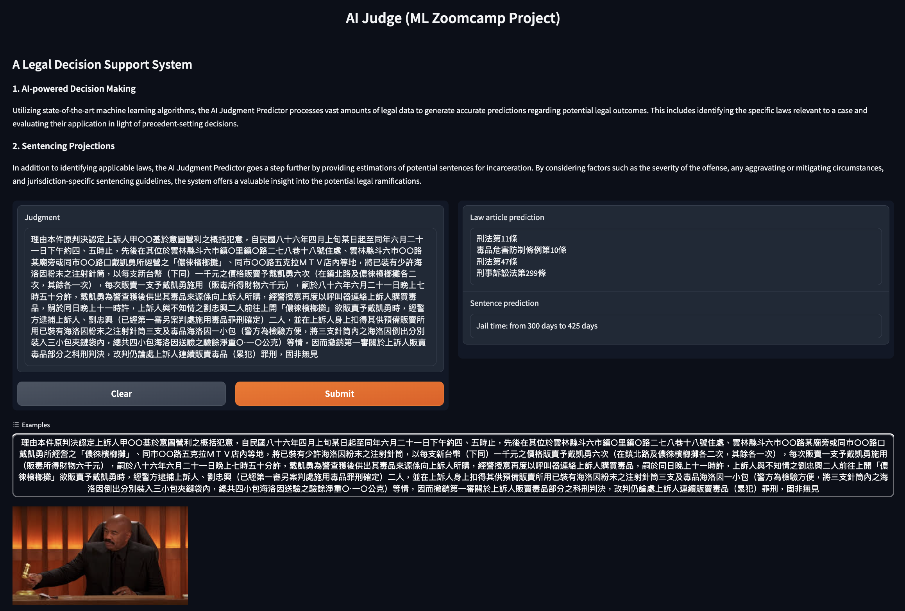

# A Legal Decision Support System 
## Problem scope 📝
In today's complex and dynamic legal landscape, the integration of Artificial Intelligence (AI) into legal assistance services has become increasingly imperative. The multifaceted nature of legal matters often poses challenges for individuals seeking clarity on applicable laws and potential sentencing outcomes. The advent of AI legal assistance, capable of predicting both **[applicable laws](https://www.legislate.tech/glossary/applicable-law)** and **potential [imprisonmen](https://dictionary.cambridge.org/dictionary/english/imprisonment)**, could addresses these challenges with unparalleled efficiency and accuracy.

Starting from a Taiwanese legal judgement dataset that targets specifically **drug-related crimes**, which I crawled from the open sourced website and put on hugginface, the goal is to have a model infer a judgment and:

1. classify the legal articles that are violated by the defendant
2. predict the length of the imprisonment

## Running the project ⚙️
### Prepare the repository 
```sh
git clone https://github.com/AndrewTsai0406/AI_Judge.git
```

### Start a virtual environment 

I advise using a virtual environment for running this project, below are instructions for doing so using [Conda](https://www.anaconda.com/) which helps one manage multiple envirnoments.

```sh
# create virtual environment
conda create -n project-legal python=3.10

# start the virtual environment
conda activate project-legal

# install requirements
pip install -r requirements.txt
```

### Data preparation
The dataset can be downloaded [here](https://huggingface.co/datasets/AndrewTsai0406/Tawan_legal_judgement) on the Hugginface. One specific dataset is present for training: [finalized data](https://huggingface.co/datasets/AndrewTsai0406/Tawan_legal_judgement/resolve/main/processed_all_drug_top_25_act_flash.csv?download=true), which should be put under a **'./data'** directory, is used for training two classifier for prediction.

### Training & saving the models
We are in a context of multi-label classification problem, with 25 predicted classes being the legal articles violated by the defendant and a multi-class classification problem for the prediction of the length of the imprisonment. All features are categorical.

Five models have been tested with a tuning of their hyperparameters using the [Lighting Flash](https://lightning-flash.readthedocs.io/en/stable/quickstart.html) library.

All these steps are described in much details in the ```train_flash.ipynb```.

To run the training script and save the mdoels, use the one script inside  `train.py` with the command:

```sh
python train.py
```
The final models will be saved in the `./models` directory.


## Where to find the files for Datacamp project ML evaluation
-  **Exploratory Data Analysis**  
    The characteristics of the judgement that are used to predict the judgement are explored in the exploratory data analysis (EDA) part of the notebook. I ran one notebook to do the analysis. A copy of it is in the [repository](notebooks/EDA.ipynb).
- **Training**
    [train.py](./scripts/train.py) runs the training for the final models. 
- **Deployment**  
    ***Predict***: Predictions can be ran with a [Gunicorn local service](https://docs.gunicorn.org/en/stable/deploy.html) (the predict function can be found within [app.py](app-fastapi/app.py)).

    To run, simply type the following command on the terminal
    ```sh
    gunicorn app:app -b 0.0.0.0:8000 -k uvicorn.workers.UvicornWorker --timeout 300
    ```
    Then, navigate to your browswer and put
    ```sh
    http://0.0.0.0:8000/gradio/
    ```
    *Example screenshot of the Gradio interface:*
    
    The predict function is also deployed on [Hugginface Space](https://huggingface.co/spaces/AndrewTsai0406/law_prediction_gradio) with Gradio. This end point will remain available until the end of the evaluation period.

   => ***[Gradio Interface](https://huggingface.co/spaces/AndrewTsai0406/law_prediction_gradio)***
